## EXECUTIVE SUMMARY

### PROJECT OVERVIEW

This project aims to develop a straightforward web application that displays a "Hello World" message along with the current date. The application will also feature a "Refresh" button, allowing users to update the displayed information. This solution addresses the client's need for a simple, functional web presence without the complexity of server-side logic.

### OBJECTIVES

1. Create a lightweight, client-side web application
2. Display "Hello World" message and current date
3. Implement a "Refresh" button for updating displayed information
4. Ensure cross-browser compatibility and responsiveness
5. Deliver a clean, intuitive user interface

### VALUE PROPOSITION

Our agency offers:

1. Rapid development and deployment of the requested web application
2. Expertise in creating efficient, client-side solutions
3. Focus on user experience and interface design
4. Scalable architecture allowing for future enhancements if needed
5. Thorough testing and quality assurance processes

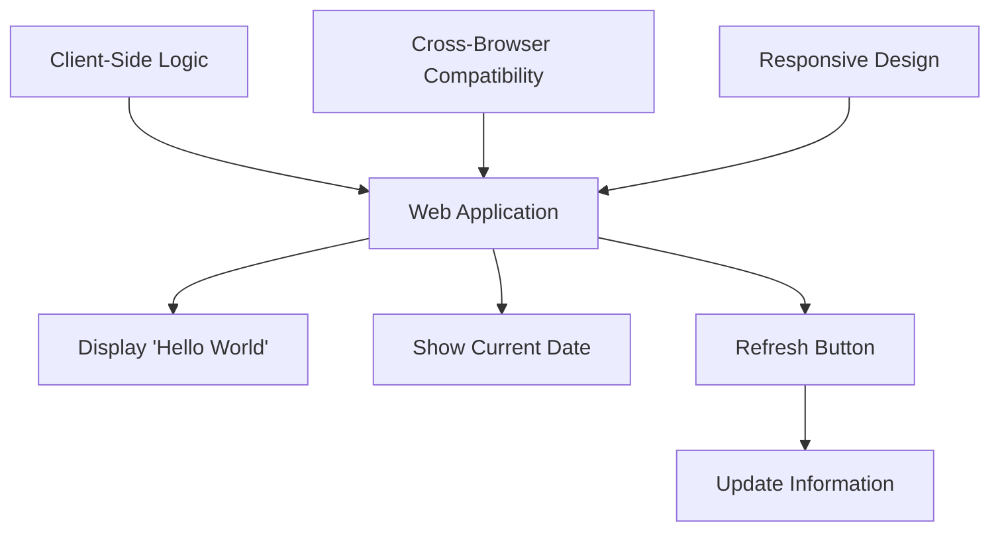

## PROJECT OBJECTIVES

### BUSINESS GOALS

1. Establish a minimal online presence for the client
2. Demonstrate the client's ability to deliver a functional web application
3. Create a foundation for potential future web development projects
4. Enhance the client's credibility in the digital space

### TECHNICAL GOALS

1. Develop a lightweight, client-side web application using modern web technologies
2. Implement real-time date display functionality
3. Create a responsive design that works across various devices and screen sizes
4. Ensure cross-browser compatibility for major web browsers
5. Implement a refresh mechanism without server-side dependencies

### SUCCESS CRITERIA

| Criterion | Description | Target |
|-----------|-------------|--------|
| Functionality | All required features work as specified | 100% completion |
| Performance | Page load time | < 2 seconds |
| Compatibility | Works on major browsers (Chrome, Firefox, Safari, Edge) | 100% compatibility |
| Responsiveness | Proper display on desktop, tablet, and mobile devices | 100% responsiveness |
| User Satisfaction | Positive feedback from client and test users | > 90% satisfaction rate |

```mermaid
graph TD
    A[Project Objectives]
    A --> B[Business Goals]
    A --> C[Technical Goals]
    A --> D[Success Criteria]
    
    B --> B1[Establish online presence]
    B --> B2[Demonstrate web capability]
    B --> B3[Foundation for future projects]
    B --> B4[Enhance digital credibility]
    
    C --> C1[Lightweight client-side app]
    C --> C2[Real-time date display]
    C --> C3[Responsive design]
    C --> C4[Cross-browser compatibility]
    C --> C5[Client-side refresh mechanism]
    
    D --> D1[Functionality: 100% completion]
    D --> D2[Performance: <2s load time]
    D --> D3[Compatibility: 100% major browsers]
    D --> D4[Responsiveness: 100% devices]
    D --> D5[User Satisfaction: >90% positive]
```

## SCOPE OF WORK

### IN-SCOPE

1. Web Application Development
   - Create a single-page web application using HTML, CSS, and JavaScript
   - Implement responsive design for desktop, tablet, and mobile devices
   - Ensure cross-browser compatibility for major browsers (Chrome, Firefox, Safari, Edge)

2. User Interface
   - Display "Hello World" message prominently on the page
   - Show current date in a clear, readable format
   - Include a "Refresh" button with appropriate styling

3. Functionality
   - Implement client-side JavaScript to fetch and display the current date
   - Create a refresh mechanism to update the date without page reload
   - Ensure all interactive elements are keyboard accessible

4. Testing and Quality Assurance
   - Conduct thorough testing on various devices and browsers
   - Perform accessibility testing to ensure WCAG 2.1 Level AA compliance

5. Deployment
   - Provide the final application files for client deployment
   - Offer guidance on hosting options and deployment procedures

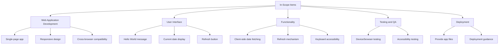

### OUT-OF-SCOPE

1. Server-side development or backend logic
2. Database integration or data storage
3. User authentication or login functionality
4. Integration with external APIs or services
5. Content management system (CMS) implementation
6. Search engine optimization (SEO) services
7. Ongoing maintenance or support after project completion
8. Custom domain registration or hosting services
9. Creation of additional pages or complex navigation
10. Implementation of analytics or tracking tools

### ASSUMPTIONS

1. The client will provide any specific design preferences or branding guidelines
2. The client is responsible for web hosting and domain management
3. Modern web browsers will be used to access the application
4. The client has the necessary rights to use any provided content or assets
5. The project timeline assumes timely client feedback and approvals

### DEPENDENCIES

| Dependency | Description | Impact |
|------------|-------------|--------|
| Client Feedback | Timely responses to design and functionality queries | May affect project timeline |
| Browser APIs | Reliance on standard JavaScript Date object | Essential for core functionality |
| Web Standards | Compliance with current HTML5, CSS3, and ECMAScript standards | Ensures broad compatibility |
| Testing Environments | Availability of various devices and browsers for testing | Crucial for quality assurance |
| Client's Hosting Environment | Compatibility with static web hosting | Necessary for deployment |

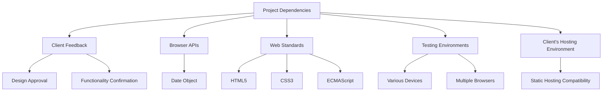

## BUDGET AND COST ESTIMATES

### COST BREAKDOWN

| Item | Description | Quantity | Rate | Total |
|------|-------------|----------|------|-------|
| Project Management | Oversight, client communication, documentation | 4 hours | $100/hour | $400 |
| UI/UX Design | Simple layout and button design | 2 hours | $90/hour | $180 |
| Front-end Development | HTML, CSS, and JavaScript implementation | 6 hours | $110/hour | $660 |
| Testing and QA | Cross-browser and device testing, bug fixes | 3 hours | $80/hour | $240 |
| Deployment Support | Guidance on hosting and deployment | 1 hour | $100/hour | $100 |
| **Total** | | | | **$1,580** |

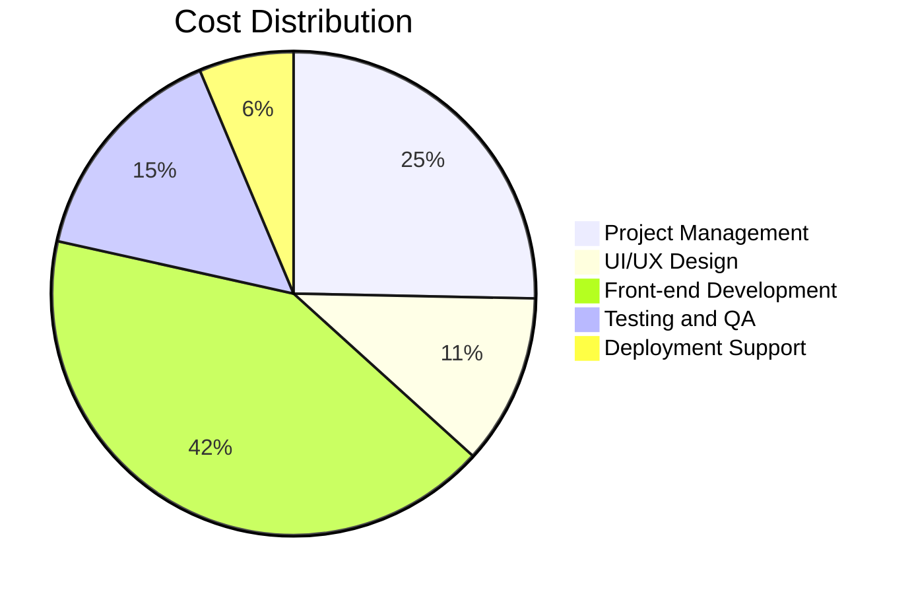

### PAYMENT SCHEDULE

| Milestone | Deliverable | Payment Percentage | Amount |
|-----------|-------------|---------------------|--------|
| Project Kickoff | Signed agreement and initial design concept | 25% | $395 |
| Design Approval | Finalized UI design | 25% | $395 |
| Development Completion | Functional web application ready for testing | 30% | $474 |
| Project Delivery | Fully tested application and deployment guidance | 20% | $316 |

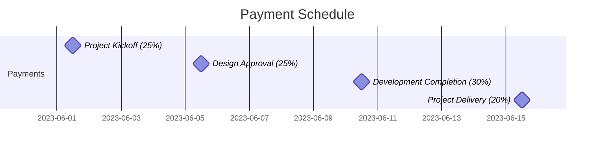

### BUDGET CONSIDERATIONS

1. Scope Creep: 
   - Risk: Client requests additional features or design changes.
   - Mitigation: Clearly define project scope in the contract. Any changes will be subject to change orders and additional costs.

2. Browser Compatibility Issues:
   - Risk: Unexpected compatibility issues with specific browsers may require additional development time.
   - Mitigation: Allocate a small contingency budget (5% of total, $79) for addressing unforeseen compatibility issues.

3. Client Feedback Delays:
   - Risk: Delayed client feedback could extend the project timeline.
   - Mitigation: Establish clear deadlines for client feedback in the project timeline. Delays may result in project extension fees.

4. Technology Changes:
   - Risk: Web standards or browser updates during development could impact the application.
   - Mitigation: Use stable, well-supported web technologies. Budget includes time for staying updated on any critical changes during the project.

5. Testing Environment Limitations:
   - Risk: Limited access to specific devices or browsers for testing.
   - Mitigation: Utilize browser emulation tools and online testing services. If specific device testing is required, additional costs may apply.

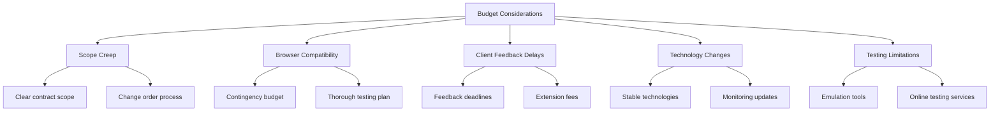

## TIMELINE AND MILESTONES

### PROJECT TIMELINE

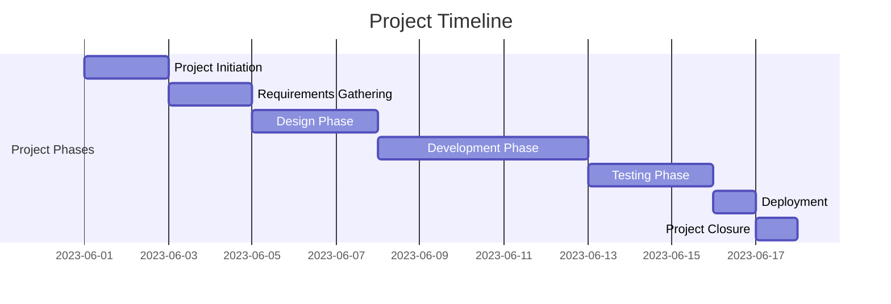

### KEY MILESTONES

| Milestone | Description | Target Date |
|-----------|-------------|-------------|
| M1: Project Kickoff | Project initiation and requirements finalization | 2023-06-02 |
| M2: Design Approval | UI/UX design approved by client | 2023-06-07 |
| M3: Development Complete | Functional web application ready for testing | 2023-06-14 |
| M4: Testing Complete | All tests passed, bugs fixed | 2023-06-19 |
| M5: Deployment | Application deployed and accessible | 2023-06-20 |
| M6: Project Handover | Final documentation and project closure | 2023-06-21 |

### CRITICAL PATH

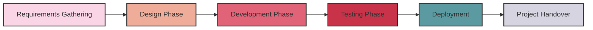

The critical path for this project consists of the following key activities:

1. Requirements Gathering: Ensuring all project requirements are clearly defined and understood.
2. Design Phase: Creating and approving the UI/UX design for the web application.
3. Development Phase: Implementing the core functionality of displaying "Hello World," today's date, and the refresh button.
4. Testing Phase: Thoroughly testing the application across different browsers and devices.
5. Deployment: Making the application live and accessible to users.
6. Project Handover: Finalizing documentation and closing the project.

These activities are crucial to keeping the project on schedule. Any delays in these tasks will directly impact the project's completion date. To mitigate risks:

- Prioritize clear communication with the client during requirements gathering and design approval.
- Allocate adequate time for development and testing to ensure quality.
- Prepare deployment environment in advance to avoid last-minute issues.
- Maintain detailed documentation throughout the project to facilitate smooth handover.

## DELIVERABLES

### LIST OF DELIVERABLES

1. Web Application
   - Single HTML file
   - CSS stylesheet
   - JavaScript file
2. Documentation
   - User Guide
   - Technical Documentation
3. Testing Reports
   - Cross-browser Compatibility Report
   - Responsive Design Test Results
4. Deployment Package
   - Compressed project files
   - Deployment Instructions

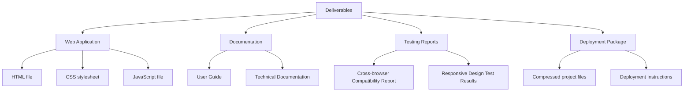

### DELIVERY SCHEDULE

| Deliverable | Expected Delivery Date |
|-------------|------------------------|
| Web Application (HTML, CSS, JS files) | 2023-06-14 |
| User Guide | 2023-06-16 |
| Technical Documentation | 2023-06-16 |
| Testing Reports | 2023-06-19 |
| Deployment Package | 2023-06-20 |

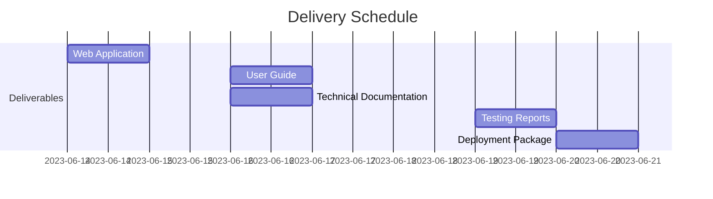

### ACCEPTANCE CRITERIA

1. Web Application
   - Displays "Hello World" message
   - Shows current date accurately
   - Includes a functional "Refresh" button
   - Responsive design works on desktop, tablet, and mobile devices
   - Compatible with latest versions of Chrome, Firefox, Safari, and Edge

2. Documentation
   - User Guide:
     - Clear instructions for using the web application
     - Explanation of all features and functionalities
   - Technical Documentation:
     - Detailed description of the application architecture
     - Code comments and explanations

3. Testing Reports
   - Cross-browser Compatibility Report:
     - Confirmation of functionality in specified browsers
     - Screenshots of application in each browser
   - Responsive Design Test Results:
     - Confirmation of proper display on various screen sizes
     - Screenshots of application on desktop, tablet, and mobile views

4. Deployment Package
   - Compressed project files:
     - All necessary files included and properly organized
   - Deployment Instructions:
     - Step-by-step guide for deploying the application
     - Troubleshooting section for common deployment issues

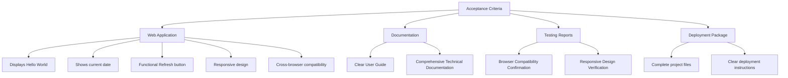