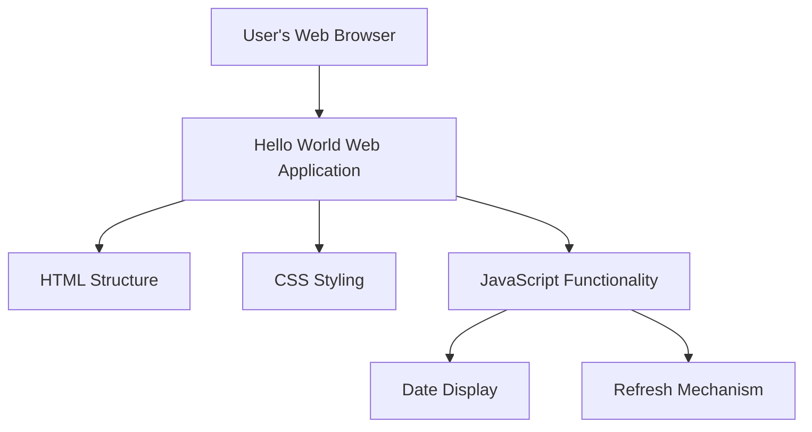
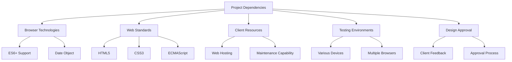
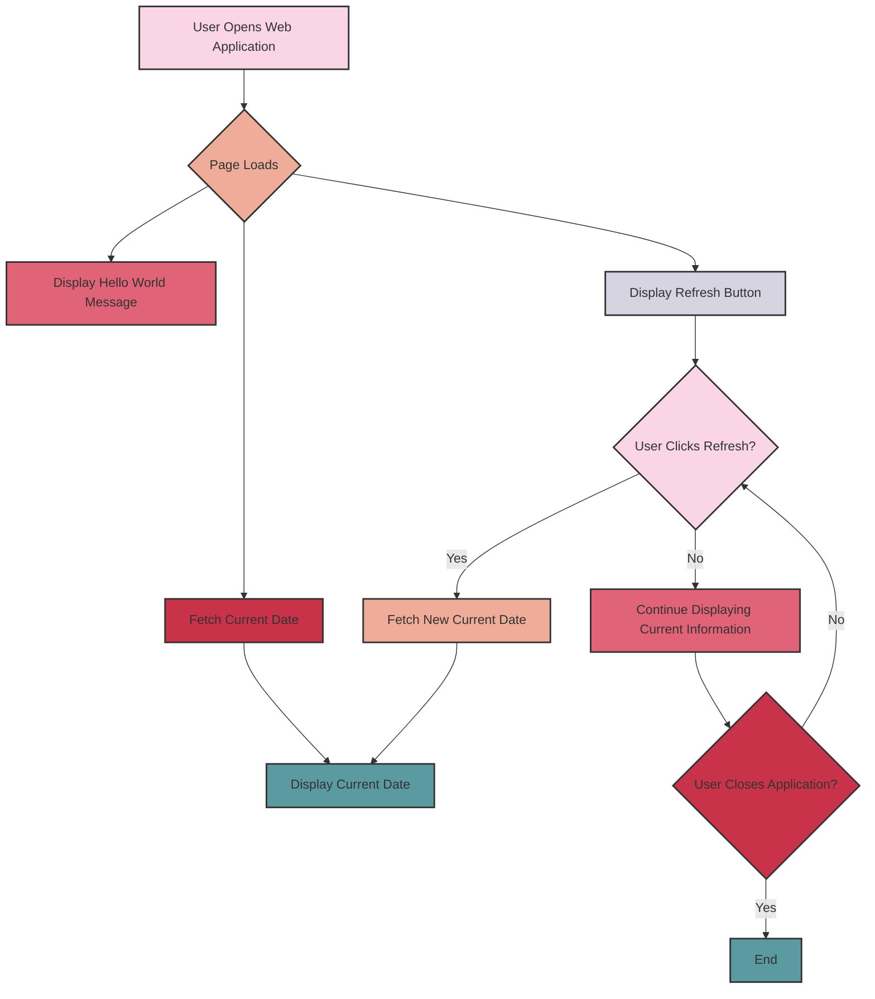
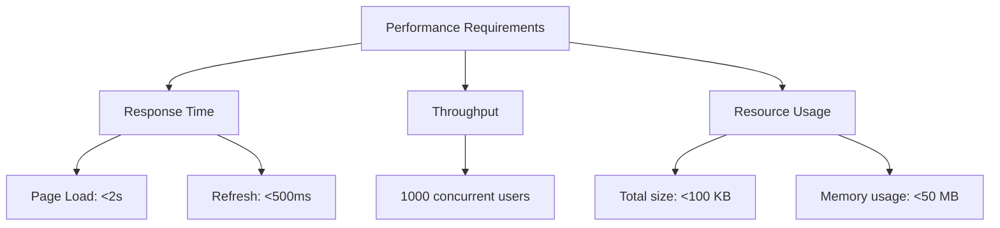
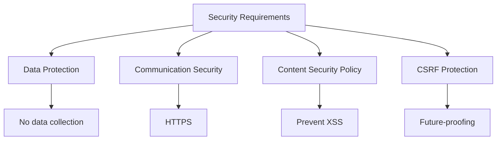
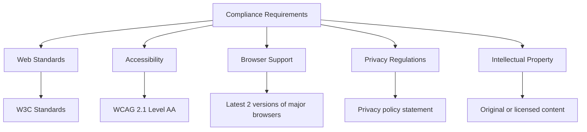
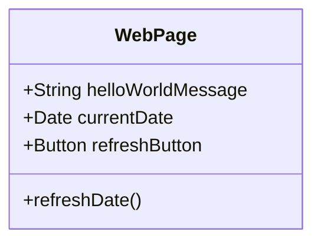
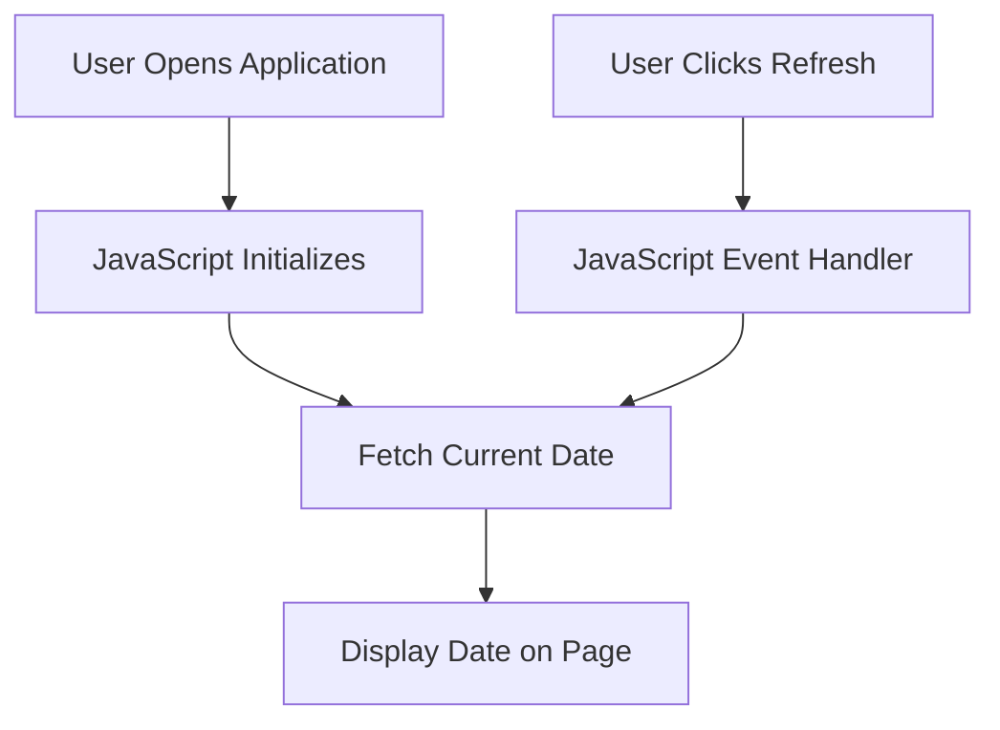
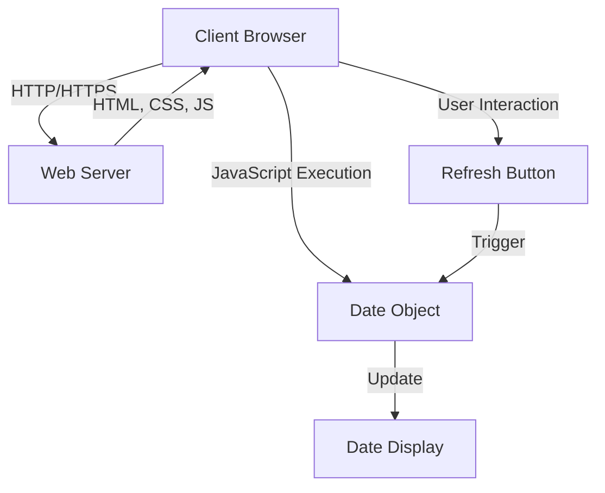

## INTRODUCTION

### PURPOSE

The purpose of this Software Requirements Specification (SRS) document is to provide a comprehensive and detailed description of the requirements for the "Hello World" web application. This document serves as a foundation for the development process, ensuring that all stakeholders have a clear understanding of the project's objectives, functionalities, and constraints.

This SRS is intended for the following audience:

1. Development Team: To guide the implementation of the web application
2. Project Managers: To plan and oversee the development process
3. Quality Assurance Team: To create test plans and verify that the final product meets the specified requirements
4. Client: To review and approve the proposed solution
5. Stakeholders: To understand the scope and capabilities of the web application

### SCOPE

This SRS outlines the requirements for a lightweight, client-side web application that displays a "Hello World" message along with the current date and a refresh button. The application aims to provide a simple yet functional web presence without the need for server-side logic.

#### Goals

1. Create a responsive, single-page web application
2. Display "Hello World" message and current date
3. Implement a refresh functionality to update the displayed information
4. Ensure cross-browser compatibility and accessibility

#### Benefits

1. Establishes a minimal online presence for the client
2. Demonstrates the ability to deliver a functional web application
3. Provides a foundation for potential future web development projects
4. Enhances the client's credibility in the digital space

#### Core Functionalities

1. Display "Hello World" Message: The application will prominently show the text "Hello World" on the main page.

2. Current Date Display: The current date will be displayed in a clear, readable format, automatically updating to reflect the user's local time.

3. Refresh Button: A button labeled "Refresh" will be included, allowing users to manually update the displayed date without reloading the entire page.

4. Responsive Design: The application will adapt to various screen sizes, ensuring a consistent user experience across desktop, tablet, and mobile devices.

5. Cross-Browser Compatibility: The web application will function correctly on major modern web browsers, including Chrome, Firefox, Safari, and Edge.

The web application will be developed using standard web technologies:

- HTML5 for structure
- CSS3 for styling and responsive design
- JavaScript (ES6+) for client-side functionality

This scope explicitly excludes server-side logic, database integration, user authentication, and any additional pages or complex navigation. The focus is on delivering a simple, efficient, and functional single-page web application that meets the specified requirements.

## PRODUCT DESCRIPTION

### PRODUCT PERSPECTIVE

The "Hello World" web application is a standalone, client-side solution designed to provide a simple yet functional web presence. It operates independently without relying on server-side components or external systems. The application fits into the broader context of lightweight web solutions, serving as an entry point for organizations or individuals looking to establish a minimal online presence.



### PRODUCT FUNCTIONS

The "Hello World" web application performs the following main functions:

1. Display Message: Presents a prominent "Hello World" message on the web page.
2. Show Current Date: Displays the current date, automatically updating to reflect the user's local time.
3. Refresh Functionality: Provides a button that, when clicked, updates the displayed date without reloading the entire page.
4. Responsive Layout: Adapts the user interface to various screen sizes and devices.

### USER CHARACTERISTICS

The intended users of this web application are:

1. General Public: Individuals with basic internet browsing skills who may access the website.
2. Client Representatives: Employees or stakeholders of the client organization who will use this as a simple web presence.
3. Developers and Testers: Technical personnel involved in maintaining or expanding the application in the future.

User Personas:

1. Sarah, 35, Marketing Manager
   - Moderate technical skills
   - Needs a simple web presence for a new product launch
   - Values ease of use and professional appearance

2. Tom, 50, Small Business Owner
   - Limited technical expertise
   - Wants to establish an online presence for his local shop
   - Appreciates straightforward, no-frills solutions

3. Alex, 28, Junior Web Developer
   - High technical proficiency
   - Tasked with maintaining and potentially expanding the application
   - Interested in clean, well-structured code

### CONSTRAINTS

1. Technical Constraints:
   - Must be purely client-side, with no server-side processing
   - Limited to HTML5, CSS3, and JavaScript (ES6+) technologies
   - Must function without external libraries or frameworks

2. Browser Compatibility:
   - Must support the latest versions of Chrome, Firefox, Safari, and Edge

3. Performance Constraints:
   - Page load time should not exceed 2 seconds on average broadband connections

4. Accessibility:
   - Must comply with WCAG 2.1 Level AA standards

5. Design Constraints:
   - Limited to a single-page application
   - Must maintain a minimalist design approach

6. Budgetary Constraints:
   - Development must be completed within the allocated budget of $1,580

7. Timeline Constraints:
   - Project must be delivered within the 3-week timeframe specified in the timeline

### ASSUMPTIONS AND DEPENDENCIES

Assumptions:

1. Users will access the application using modern web browsers with JavaScript enabled.
2. The client will provide timely feedback during the design and development phases.
3. The application will be hosted on a standard web hosting service capable of serving static files.
4. Users have a basic understanding of web navigation and interacting with buttons.
5. The client has the necessary rights to use the "Hello World" message and any associated branding.

Dependencies:

1. Browser Technologies:
   - Relies on browser support for ES6+ JavaScript features
   - Depends on browser's built-in Date object for current date functionality

2. Web Standards:
   - Dependent on current HTML5, CSS3, and ECMAScript standards

3. Client Resources:
   - Requires client to provide web hosting for the final application
   - Depends on client's ability to update and maintain the application post-delivery

4. Testing Environments:
   - Relies on access to various devices and browsers for comprehensive testing

5. Design Approval:
   - Final implementation is dependent on client approval of the initial design concept



## PROCESS FLOWCHART

The following flowchart illustrates the main processes and user interactions within the "Hello World" web application:



This flowchart demonstrates the simple yet effective process flow of the "Hello World" web application:

1. The user opens the web application in their browser.
2. The page loads, triggering three simultaneous actions:
   - Displaying the "Hello World" message
   - Fetching and displaying the current date
   - Displaying the Refresh button
3. The user can then choose to click the Refresh button or continue viewing the current information.
4. If the Refresh button is clicked, the application fetches and displays the new current date.
5. This process continues until the user closes the application.

The flowchart aligns with the previously specified technologies:
- HTML5 for structure
- CSS3 for styling and responsive design
- JavaScript (ES6+) for client-side functionality, including date fetching and refresh mechanism

This simple process flow ensures a lightweight, efficient web application that meets the specified requirements without the need for server-side logic or complex interactions.

Here's a breakdown of the product features with the requested sub-sections, maintaining consistency with the previously mentioned technology and framework choices:

### Feature 1: Hello World Display

#### ID
F001

#### DESCRIPTION
Display the "Hello World" message prominently on the web page.

#### PRIORITY
High

#### TABLE OF FUNCTIONAL REQUIREMENTS

| ID | Requirement | Description |
|----|-------------|-------------|
| F001-1 | Message Display | The "Hello World" message shall be displayed in a clear, readable font |
| F001-2 | Positioning | The message shall be centrally positioned on the page |
| F001-3 | Responsiveness | The message shall maintain readability across all device sizes |

### Feature 2: Current Date Display

#### ID
F002

#### DESCRIPTION
Show the current date on the web page, automatically updating to reflect the user's local time.

#### PRIORITY
High

#### TABLE OF FUNCTIONAL REQUIREMENTS

| ID | Requirement | Description |
|----|-------------|-------------|
| F002-1 | Date Retrieval | The application shall use JavaScript to fetch the current date |
| F002-2 | Date Format | The date shall be displayed in a clear, human-readable format (e.g., "June 1, 2023") |
| F002-3 | Local Time | The displayed date shall reflect the user's local time zone |
| F002-4 | Positioning | The date shall be positioned below the "Hello World" message |

### Feature 3: Refresh Button

#### ID
F003

#### DESCRIPTION
Implement a button labeled "Refresh" that updates the displayed date without reloading the entire page.

#### PRIORITY
Medium

#### TABLE OF FUNCTIONAL REQUIREMENTS

| ID | Requirement | Description |
|----|-------------|-------------|
| F003-1 | Button Display | A clearly labeled "Refresh" button shall be visible on the page |
| F003-2 | Click Functionality | Clicking the button shall trigger a JavaScript function to update the date |
| F003-3 | Visual Feedback | The button shall provide visual feedback when clicked (e.g., a subtle animation) |
| F003-4 | Accessibility | The button shall be keyboard accessible and have appropriate ARIA labels |

### Feature 4: Responsive Design

#### ID
F004

#### DESCRIPTION
Ensure the web application adapts to various screen sizes, providing a consistent user experience across desktop, tablet, and mobile devices.

#### PRIORITY
High

#### TABLE OF FUNCTIONAL REQUIREMENTS

| ID | Requirement | Description |
|----|-------------|-------------|
| F004-1 | Flexible Layout | The page layout shall adjust fluidly to different screen widths |
| F004-2 | Mobile Compatibility | All features shall be fully functional on mobile devices |
| F004-3 | Text Scaling | Text size shall adjust appropriately for readability on smaller screens |
| F004-4 | Touch-friendly | Interactive elements shall be sized appropriately for touch interactions on mobile devices |

### Feature 5: Cross-Browser Compatibility

#### ID
F005

#### DESCRIPTION
Ensure the web application functions correctly on major modern web browsers.

#### PRIORITY
High

#### TABLE OF FUNCTIONAL REQUIREMENTS

| ID | Requirement | Description |
|----|-------------|-------------|
| F005-1 | Chrome Support | The application shall function correctly on the latest version of Google Chrome |
| F005-2 | Firefox Support | The application shall function correctly on the latest version of Mozilla Firefox |
| F005-3 | Safari Support | The application shall function correctly on the latest version of Apple Safari |
| F005-4 | Edge Support | The application shall function correctly on the latest version of Microsoft Edge |
| F005-5 | Consistent Rendering | The application shall maintain consistent visual appearance across supported browsers |

This feature breakdown aligns with the previously specified technologies:
- HTML5 for structure
- CSS3 for styling and responsive design
- JavaScript (ES6+) for client-side functionality

The features focus on delivering a simple, efficient, and functional single-page web application that meets the specified requirements without the need for server-side logic or complex interactions.

## NON-FUNCTIONAL REQUIREMENTS

### PERFORMANCE

1. Response Time:
   - The web application shall load completely within 2 seconds on a standard broadband connection (10 Mbps or higher).
   - The "Refresh" button shall update the date within 500 milliseconds of being clicked.

2. Throughput:
   - The application shall support up to 1000 concurrent users without degradation in performance.

3. Resource Usage:
   - The total size of all assets (HTML, CSS, JavaScript) shall not exceed 100 KB.
   - The application shall not consume more than 50 MB of client-side memory during operation.



### SAFETY

1. Error Handling:
   - The application shall gracefully handle and log any JavaScript errors without crashing or becoming unresponsive.
   - In case of failure to fetch the current date, the application shall display a user-friendly error message and provide instructions for manual refresh.

2. Data Integrity:
   - The application shall not store or transmit any user data, minimizing the risk of data loss or corruption.

3. Fail-safe Operation:
   - If JavaScript is disabled in the user's browser, the application shall display a static version of the "Hello World" message and a note about enabling JavaScript for full functionality.

### SECURITY

1. Data Protection:
   - The application shall not collect, store, or transmit any personal user data.

2. Communication Security:
   - The application shall be served over HTTPS to ensure secure communication between the client and server.

3. Content Security Policy:
   - Implement a Content Security Policy (CSP) to prevent Cross-Site Scripting (XSS) attacks.

4. Cross-Site Request Forgery (CSRF) Protection:
   - Although not directly applicable to this client-side application, ensure that any future server-side additions implement CSRF protection.



### QUALITY

1. Availability:
   - The web application shall have an uptime of 99.9%, excluding scheduled maintenance periods.

2. Maintainability:
   - The source code shall adhere to ESLint standards for JavaScript to ensure code quality and consistency.
   - The application shall use semantic HTML5 elements to improve code readability and maintainability.

3. Usability:
   - The user interface shall be intuitive, requiring no prior training for users to operate the application.
   - The application shall be accessible, conforming to WCAG 2.1 Level AA standards.

4. Scalability:
   - The application architecture shall allow for easy addition of new features or content in the future.

5. Reliability:
   - The application shall function correctly across all specified browsers and devices 99.99% of the time.
   - The date display and refresh functionality shall provide accurate results 100% of the time, accounting for different time zones and daylight saving time changes.

### COMPLIANCE

1. Web Standards:
   - The application shall comply with W3C standards for HTML5, CSS3, and ECMAScript 2015+ (ES6+).

2. Accessibility:
   - The application shall conform to Web Content Accessibility Guidelines (WCAG) 2.1 Level AA.

3. Browser Support:
   - The application shall support the latest two major versions of Chrome, Firefox, Safari, and Edge browsers at the time of deployment.

4. Privacy Regulations:
   - Although the application does not collect personal data, it shall include a minimal privacy policy statement to comply with global privacy regulations such as GDPR and CCPA.

5. Intellectual Property:
   - All code and assets used in the application shall be original work or properly licensed for use in this project.



These non-functional requirements align with the previously specified technologies (HTML5, CSS3, and JavaScript ES6+) and the lightweight, client-side nature of the application. They ensure a high-quality, performant, and compliant web application that meets modern web standards and user expectations.

## DATA REQUIREMENTS

### DATA MODELS

For this simple "Hello World" web application, there is no complex data model or database structure required. The application operates entirely on the client-side and does not persist any data. However, we can represent the basic structure of the application's data as follows:



This diagram represents the main elements of our web application:
- `helloWorldMessage`: A string containing "Hello World"
- `currentDate`: The current date object
- `refreshButton`: The button element for refreshing the date
- `refreshDate()`: A method to update the current date

### DATA STORAGE

As this is a client-side application with no server-side components, there is no persistent data storage. All data is transient and exists only in the user's browser memory during the session. However, we can outline some considerations for data handling:

1. Local Storage: While not currently implemented, future versions could use browser's localStorage to remember user preferences (e.g., preferred date format).

2. Caching: The application's static assets (HTML, CSS, JavaScript) should be properly cached by the browser to improve load times on subsequent visits.

3. Data Retention: No user data is collected or retained beyond the current session.

4. Redundancy, Backup, and Recovery: Not applicable for this client-side application. However, the source code should be version-controlled (e.g., using Git) to maintain code history and facilitate recovery if needed.

### DATA PROCESSING

The data processing in this application is minimal and occurs entirely on the client-side. Here's an overview of the data flow:



Data Security Considerations:
1. Input Validation: Although this application doesn't accept user input, any future additions that do should implement proper input validation to prevent XSS attacks.

2. Content Security Policy (CSP): Implement a strict CSP to prevent unauthorized script execution and other common web vulnerabilities.

3. HTTPS: While not directly handled by the application, it should be served over HTTPS to ensure data integrity during transit.

4. No Sensitive Data: The application does not handle any sensitive user data, minimizing security risks.

5. Third-party Libraries: If any third-party JavaScript libraries are introduced in the future, they should be vetted for security and kept up-to-date.

6. Cross-Origin Resource Sharing (CORS): Not applicable for the current version, but any future API integrations should implement proper CORS policies.

Data Flow:
1. Date Retrieval: The application uses the built-in JavaScript Date object to fetch the current date. This operation is performed client-side and does not involve any network requests.

2. Date Display: The retrieved date is formatted and displayed on the webpage using DOM manipulation.

3. Refresh Mechanism: When the user clicks the "Refresh" button, the application re-fetches the current date and updates the display, all without any server communication.

This data processing approach aligns with the previously specified technologies (HTML5, CSS3, and JavaScript ES6+) and maintains the lightweight, client-side nature of the application. It ensures efficient operation without the need for server-side processing or database interactions.

## EXTERNAL INTERFACES

### USER INTERFACES

The "Hello World" web application will feature a simple, intuitive user interface designed to be accessible and responsive across various devices and screen sizes. The interface will consist of the following elements:

1. Header: Displaying the "Hello World" message prominently.
2. Date Display: Showing the current date in a clear, readable format.
3. Refresh Button: A clickable button labeled "Refresh" to update the displayed date.

The user interface will adhere to the following requirements:

1. Responsive Design: The layout will adapt seamlessly to desktop, tablet, and mobile screen sizes.
2. Accessibility: The interface will comply with WCAG 2.1 Level AA standards, ensuring it is accessible to users with disabilities.
3. Consistent Styling: The application will use a cohesive color scheme and typography that aligns with modern web design principles.
4. Intuitive Layout: Elements will be arranged logically, with the "Hello World" message at the top, followed by the date display and refresh button.

Placeholder for UI Mockup:

```
+----------------------------------+
|          Hello World             |
|                                  |
|   Current Date: [Date Display]   |
|                                  |
|          [Refresh]               |
|                                  |
+----------------------------------+
```

### SOFTWARE INTERFACES

While the "Hello World" web application is primarily a standalone, client-side solution, it does interact with some software interfaces:

1. Web Browsers:
   - The application will be compatible with the latest two major versions of Chrome, Firefox, Safari, and Edge.
   - It will utilize standard Web APIs provided by these browsers, including:
     - DOM (Document Object Model) for manipulating page content
     - Date object for retrieving and formatting the current date
     - Event handling for the refresh button functionality

2. Operating Systems:
   - The application will be platform-independent and run on any operating system with a compatible web browser.

3. Web Servers:
   - While not directly part of the application, it will be designed to be served by standard web servers (e.g., Apache, Nginx) without requiring any server-side processing.

### COMMUNICATION INTERFACES

The "Hello World" web application, being a client-side solution, has minimal communication interface requirements. However, the following aspects are relevant:

1. HTTP/HTTPS:
   - The application will be served over standard HTTP or HTTPS protocols.
   - HTTPS is recommended for enhanced security, even though no sensitive data is transmitted.

2. Client-Server Communication:
   - Initial page load: The web server will deliver the HTML, CSS, and JavaScript files to the client's browser.
   - After initial load, no further server communication is required for the core functionality.

3. Content Delivery:
   - Static assets (HTML, CSS, JavaScript) should be delivered with appropriate caching headers to optimize performance.

4. Cross-Origin Resource Sharing (CORS):
   - Not applicable in the current version, but any future enhancements involving external APIs should implement proper CORS policies.

5. Data Formats:
   - The application uses standard web technologies and doesn't require any special data formats for communication.
   - Date information is handled entirely client-side using the JavaScript Date object.



This diagram illustrates the basic communication flow of the application, emphasizing its client-side nature and minimal server interaction.

These external interface specifications align with the previously mentioned technologies (HTML5, CSS3, and JavaScript ES6+) and maintain the lightweight, client-side focus of the application. They ensure compatibility with modern web standards and browsers while keeping the implementation simple and efficient.

## APPENDICES

### GLOSSARY

1. Client-side: Refers to operations that are performed by the client's web browser, rather than on a remote server.

2. Responsive Design: A web design approach that creates dynamic changes to the appearance of a website, depending on the screen size and orientation of the device being used to view it.

3. Cross-browser Compatibility: The ability of a website or web application to function correctly across different web browsers.

4. DOM (Document Object Model): A programming interface for HTML and XML documents, representing the structure of a document as a tree-like hierarchy of objects.

5. Static Web Hosting: A hosting service that serves web pages and assets as they are stored, without server-side processing.

6. Semantic HTML: The use of HTML markup to reinforce the meaning of the content, rather than merely to define its appearance.

7. ECMAScript: The standardized version of JavaScript, with ES6+ referring to versions of the ECMAScript specification from 2015 onwards.

### ACRONYMS

1. HTML: HyperText Markup Language
2. CSS: Cascading Style Sheets
3. JS: JavaScript
4. SRS: Software Requirements Specification
5. UI: User Interface
6. UX: User Experience
7. API: Application Programming Interface
8. WCAG: Web Content Accessibility Guidelines
9. CORS: Cross-Origin Resource Sharing
10. CSP: Content Security Policy
11. XSS: Cross-Site Scripting
12. HTTPS: HyperText Transfer Protocol Secure
13. W3C: World Wide Web Consortium
14. GDPR: General Data Protection Regulation
15. CCPA: California Consumer Privacy Act

### ADDITIONAL REFERENCES

1. MDN Web Docs: Comprehensive resource for web technologies
   https://developer.mozilla.org/

2. W3C Web Design and Applications Standards
   https://www.w3.org/standards/webdesign/

3. WCAG 2.1 Guidelines
   https://www.w3.org/TR/WCAG21/

4. ECMAScript 2015 (ES6) Specification
   https://www.ecma-international.org/ecma-262/6.0/

5. Google Web Fundamentals: Best practices for modern web development
   https://developers.google.com/web/fundamentals

6. Can I Use: Browser support tables for modern web technologies
   https://caniuse.com/

7. Web.dev: Guidance for modern web development
   https://web.dev/

8. A11Y Project: Community-driven effort to make web accessibility easier
   https://a11yproject.com/

These additional references provide valuable resources for understanding and implementing the technologies and standards mentioned throughout this SRS document. They offer in-depth information on HTML5, CSS3, JavaScript (ES6+), web accessibility, and best practices for modern web development, all of which are relevant to the "Hello World" web application project.