## INTRODUCTION

### SYSTEM OVERVIEW

The "Hello World" web application is a lightweight, client-side solution designed to provide a simple yet functional web presence. This system consists of a single-page web application that displays a "Hello World" message, the current date, and a refresh button. The application is built entirely using front-end web technologies, requiring no server-side logic or database interactions.

Key components of the system include:

1. User Interface: A clean, responsive layout that adapts to various screen sizes and devices.
2. Date Display: A dynamic element showing the current date, updated in real-time.
3. Refresh Functionality: A button that allows users to manually update the displayed date.

The system architecture can be visualized as follows:

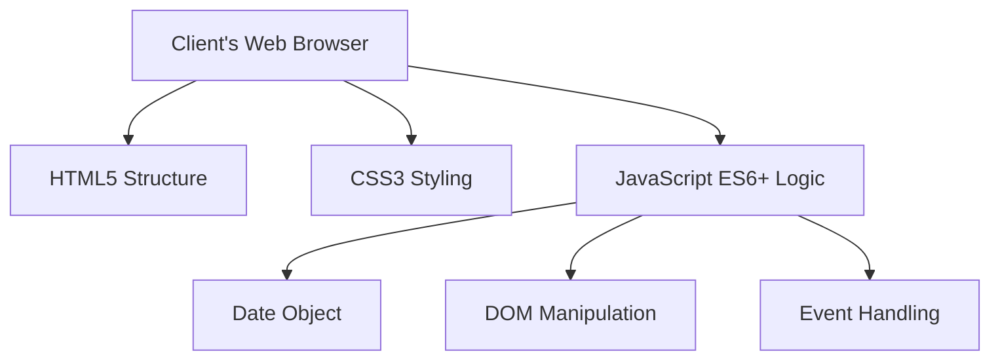

This diagram illustrates the client-side nature of the application, where all processing occurs within the user's web browser.

The system is designed with the following key characteristics:

1. Simplicity: Focused on core functionality without unnecessary complexities.
2. Performance: Lightweight and fast-loading, with minimal resource requirements.
3. Accessibility: Compliant with WCAG 2.1 Level AA standards.
4. Cross-browser Compatibility: Functions consistently across major modern web browsers.
5. Responsiveness: Adapts to various screen sizes and devices.

Technology Stack:
- HTML5 for structure
- CSS3 for styling and responsive design
- JavaScript (ES6+) for client-side functionality

The system does not require:
- Server-side processing
- Database interactions
- User authentication or authorization
- External API integrations

This simple yet effective system architecture ensures a fast, reliable, and easily maintainable web application that meets the specified requirements while providing a foundation for potential future enhancements.

## SYSTEM ARCHITECTURE

### PROGRAMMING LANGUAGES

The "Hello World" web application will utilize the following programming languages:

1. HTML5 (HyperText Markup Language 5)
   - Justification: Provides the structural foundation for the web page, offering semantic elements for improved accessibility and SEO.

2. CSS3 (Cascading Style Sheets 3)
   - Justification: Enables responsive design and styling, ensuring a consistent and visually appealing user interface across different devices and screen sizes.

3. JavaScript (ES6+)
   - Justification: Allows for dynamic content updates, handling user interactions, and implementing the date refresh functionality entirely on the client-side.

| Language | Purpose | Justification |
|----------|---------|---------------|
| HTML5 | Structure | Semantic markup, accessibility, SEO |
| CSS3 | Styling | Responsive design, visual consistency |
| JavaScript (ES6+) | Functionality | Dynamic updates, user interactions |

These choices align with the previously specified technologies and maintain the lightweight, client-side nature of the application.

### HIGH-LEVEL ARCHITECTURE DIAGRAM

The following diagram provides an overview of the system's components and their interactions:

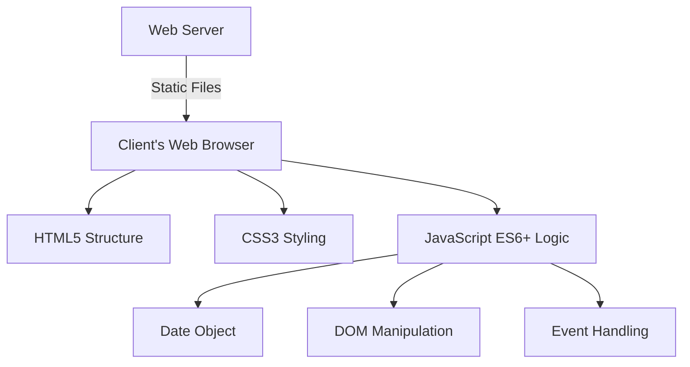

This high-level architecture emphasizes the client-side nature of the application, with all processing occurring within the user's web browser. The web server's role is limited to serving static files.

### COMPONENT DIAGRAMS

The "Hello World" web application consists of the following main components:

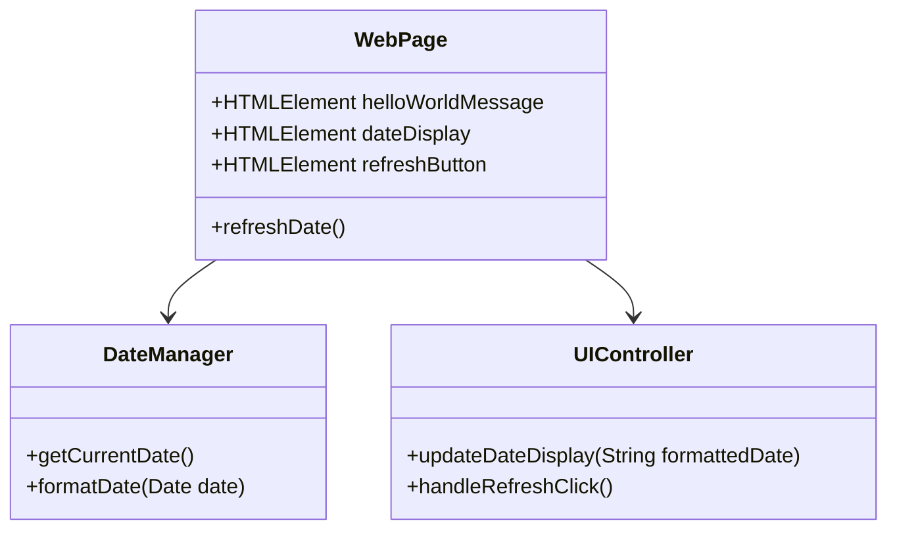

This component diagram illustrates the main classes and their relationships within the application:

1. WebPage: Represents the main structure of the web application.
2. DateManager: Handles date-related operations.
3. UIController: Manages user interface updates and interactions.

### SEQUENCE DIAGRAMS

The following sequence diagram illustrates the interaction flow when a user refreshes the date:

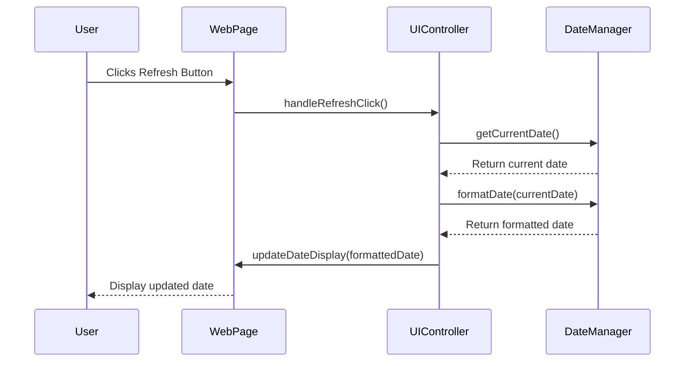

This sequence diagram shows the flow of control and data when the user interacts with the refresh button, highlighting the separation of concerns between different components of the system.

### DATA-FLOW DIAGRAM

The following data-flow diagram explains how information moves through the system:

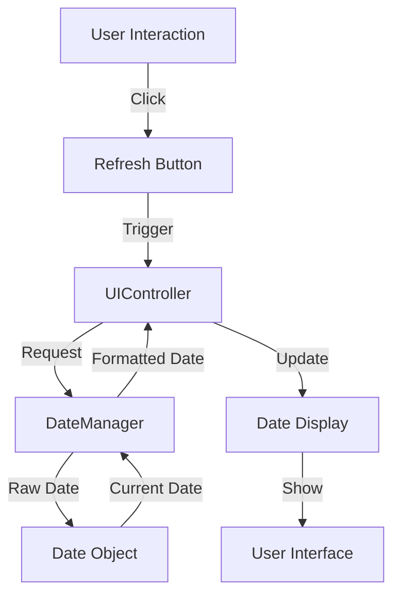

This data-flow diagram illustrates how user interaction triggers the flow of date information through the system, from the initial click to the final display update. It emphasizes the client-side nature of the application, with all data processing occurring within the browser.

The system architecture described here maintains consistency with the previously specified technologies (HTML5, CSS3, and JavaScript ES6+) and the lightweight, client-side focus of the application. It provides a clear overview of the system's structure, components, and data flow, ensuring a solid foundation for development and future maintenance.

## SYSTEM DESIGN

### PROGRAMMING LANGUAGES

The "Hello World" web application will utilize the following programming languages:

| Language | Purpose | Justification |
|----------|---------|---------------|
| HTML5 | Structure | Provides semantic markup for improved accessibility and SEO. Widely supported across browsers. |
| CSS3 | Styling | Enables responsive design and modern styling capabilities. Supports media queries for device-specific layouts. |
| JavaScript (ES6+) | Functionality | Allows for dynamic content updates and user interactions. Provides robust date handling capabilities. |

These choices align with the previously specified technologies and maintain the lightweight, client-side nature of the application.

### DATABASE DESIGN

For this simple "Hello World" web application, no database is required as all functionality is client-side and does not persist data. However, for future scalability, we can outline a potential structure:

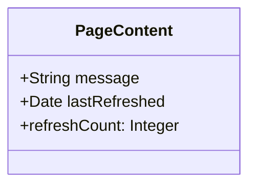

This diagram represents a potential future data structure if we decide to add server-side tracking of refresh counts or customizable messages.

### API DESIGN

As this is a client-side application, there are no traditional APIs. However, we can outline the main JavaScript functions that will act as internal APIs:

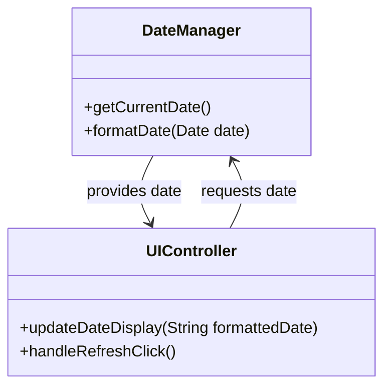

These internal APIs maintain the separation of concerns between date management and UI updates.

### USER INTERFACE DESIGN

The user interface will be simple and intuitive, consisting of three main components:

1. Hello World Message
2. Current Date Display
3. Refresh Button

Layout:

```
+----------------------------------+
|          Hello World             |
|                                  |
|   Current Date: [Date Display]   |
|                                  |
|          [Refresh]               |
|                                  |
+----------------------------------+
```

Functionality:
- The "Hello World" message will be static and prominently displayed.
- The current date will update automatically on page load and when the refresh button is clicked.
- The refresh button will be clearly labeled and provide visual feedback when clicked.

Responsive Design:
- The layout will adapt to different screen sizes using CSS media queries.
- On smaller screens, the components will stack vertically for better readability.

Accessibility:
- High contrast colors will be used for text and background.
- The refresh button will be keyboard accessible and have appropriate ARIA labels.
- Font sizes will be specified in relative units for easy scaling.

This user interface design aligns with the previously specified technologies (HTML5, CSS3, and JavaScript ES6+) and maintains the lightweight, client-side focus of the application. It provides a clean, accessible, and responsive interface that meets the project requirements.

## TECHNOLOGY STACK

### PROGRAMMING LANGUAGES

The "Hello World" web application will utilize the following programming languages:

| Language | Version | Justification |
|----------|---------|---------------|
| HTML5 | Latest | Provides semantic structure for the web page, enhancing accessibility and SEO. |
| CSS3 | Latest | Enables responsive design and styling, ensuring a consistent user interface across devices. |
| JavaScript | ES6+ | Allows for dynamic content updates and handling user interactions entirely on the client-side. |

These choices align with the previously specified technologies and maintain the lightweight, client-side nature of the application.

### FRAMEWORKS AND LIBRARIES

Given the simplicity of the "Hello World" web application and the requirement for a lightweight, client-side solution, we will not be using any external frameworks or libraries. This decision aligns with the project's goals of minimalism and efficiency.

However, for future scalability and maintenance, we will implement a basic project structure:

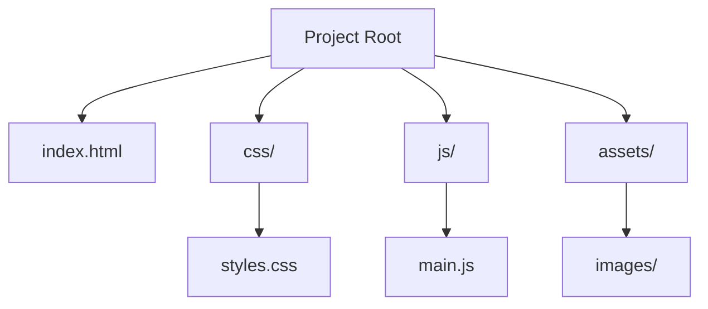

This structure provides a clean separation of concerns and allows for easy expansion if needed in the future.

### DATABASES

The current version of the "Hello World" web application does not require any database implementation as it operates entirely on the client-side without data persistence. All necessary data (current date) is generated and managed within the user's browser session.

### THIRD-PARTY SERVICES

The application in its current form does not require integration with any third-party services or APIs. All functionality, including date retrieval and display, is handled using native JavaScript capabilities.

However, for future considerations, we may want to keep in mind potential integrations:

1. Analytics Service: To track user interactions and page views (e.g., Google Analytics).
2. Content Delivery Network (CDN): For efficient delivery of static assets in case of future expansion.

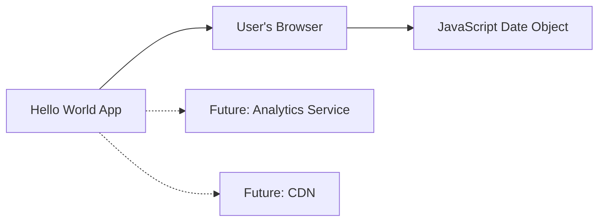

This technology stack maintains consistency with the previously specified requirements, focusing on a lightweight, client-side application using HTML5, CSS3, and JavaScript ES6+. It provides a solid foundation for the current project while allowing for potential future enhancements.

## SECURITY CONSIDERATIONS

### AUTHENTICATION AND AUTHORIZATION

For the current version of the "Hello World" web application, there is no user authentication or authorization required as it is a public, read-only application. However, for future scalability and potential enhancements, we can outline a basic structure:

| Feature | Implementation |
|---------|----------------|
| Authentication | Not applicable in current version |
| Authorization | Not applicable in current version |

For future versions that might require user interaction or personalized content:

1. Consider implementing a simple authentication system using JSON Web Tokens (JWT) for stateless authentication.
2. Use HTTPS to secure the transmission of authentication credentials.
3. Implement role-based access control (RBAC) if different user types are introduced.

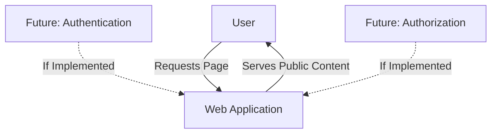

### DATA SECURITY

While the current version of the application does not handle sensitive data, it's important to implement best practices for data security:

1. No Data Collection: The application does not collect, store, or process any user data.
2. Client-Side Data: The only dynamic data (current date) is generated client-side and not persisted.
3. HTTPS: Serve the application over HTTPS to encrypt data in transit, even though no sensitive information is being transmitted.

For future versions:

| Data Type | Security Measure |
|-----------|------------------|
| User Preferences | If implemented, use browser's localStorage with encryption |
| Session Data | If needed, use secure, HTTP-only cookies |

### SECURITY PROTOCOLS

Implement the following security protocols to maintain system security:

1. Content Security Policy (CSP):
   - Implement a strict CSP header to prevent XSS attacks and unauthorized script execution.
   - Example CSP header:
     ```
     Content-Security-Policy: default-src 'self'; script-src 'self' 'unsafe-inline'; style-src 'self' 'unsafe-inline';
     ```

2. Cross-Origin Resource Sharing (CORS):
   - For the current version, CORS is not applicable as there are no API calls.
   - For future versions with API integration, implement proper CORS policies.

3. Security Headers:
   - Implement additional security headers:
     ```
     X-Content-Type-Options: nosniff
     X-Frame-Options: DENY
     Referrer-Policy: strict-origin-when-cross-origin
     ```

4. Regular Security Audits:
   - Conduct periodic security audits of the codebase and deployed application.
   - Use tools like OWASP ZAP for automated security testing.

5. Dependency Management:
   - Regularly update dependencies to patch known vulnerabilities.
   - Use tools like npm audit to check for vulnerabilities in npm packages.

6. Error Handling:
   - Implement proper error handling to prevent information leakage through error messages.

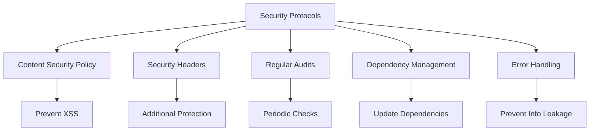

These security considerations align with the previously specified technologies (HTML5, CSS3, and JavaScript ES6+) and maintain the lightweight, client-side nature of the application. While the current version has minimal security requirements due to its simplicity, these protocols provide a solid foundation for future enhancements and ensure best practices are followed from the start.